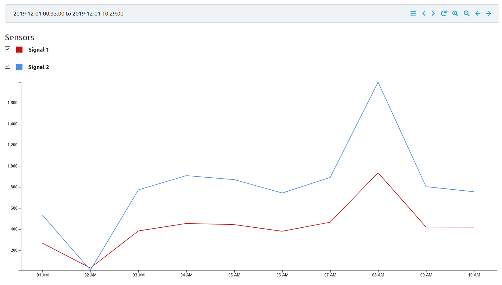
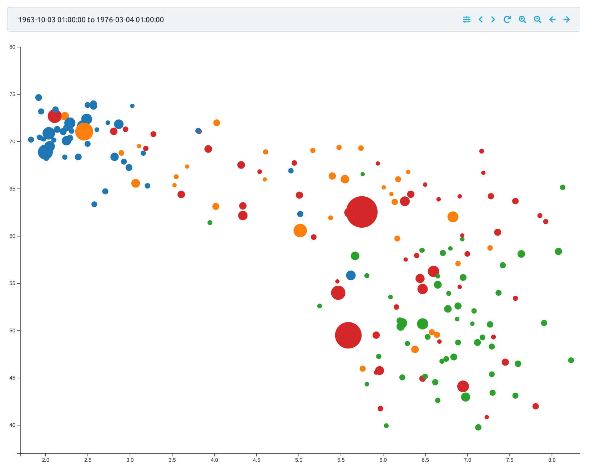
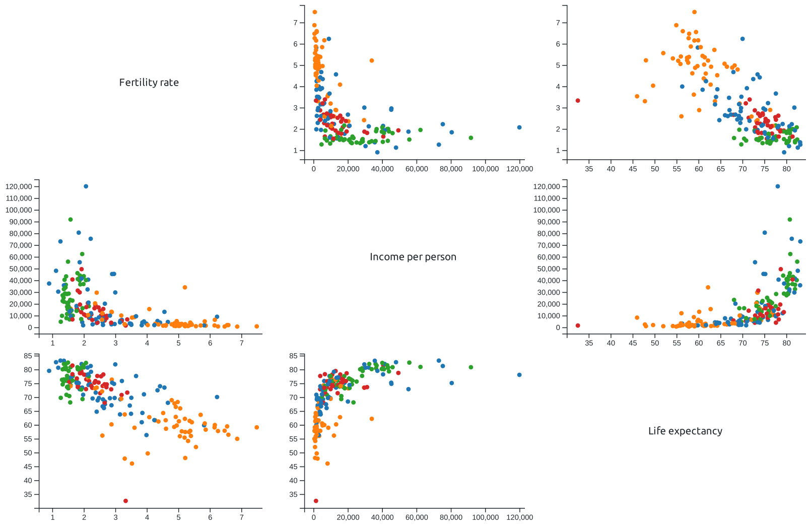
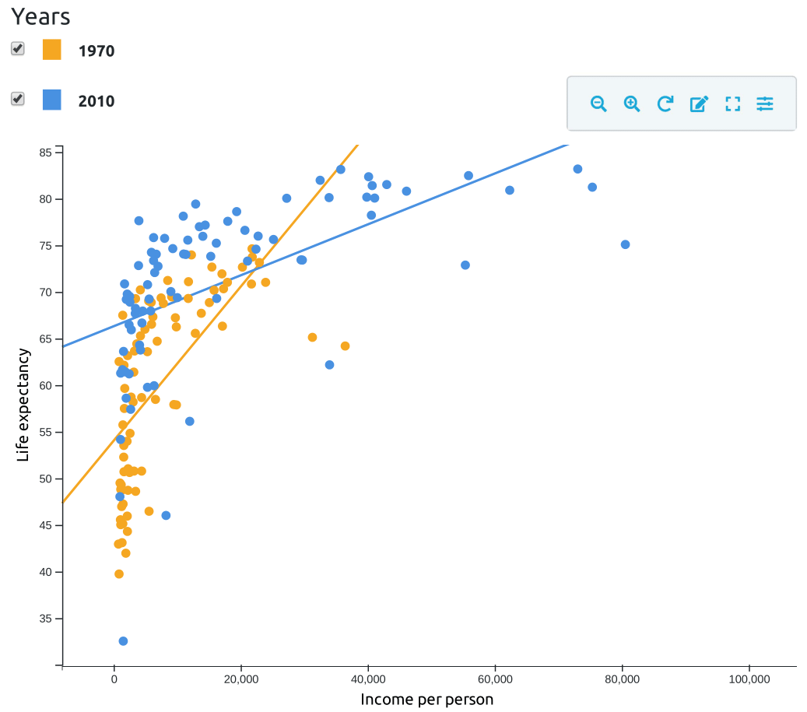
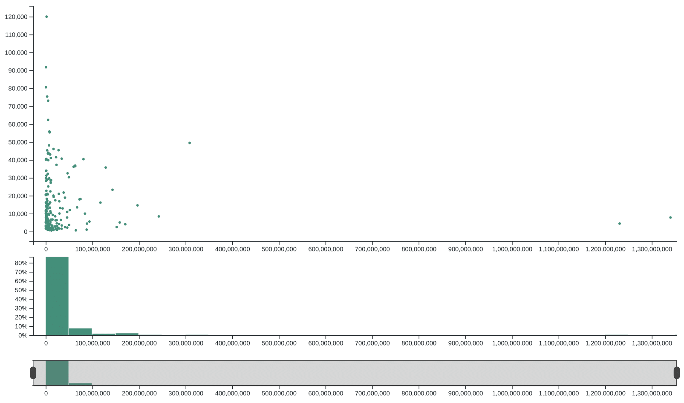
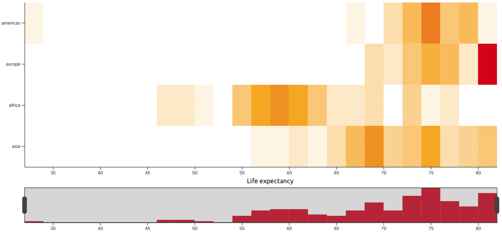
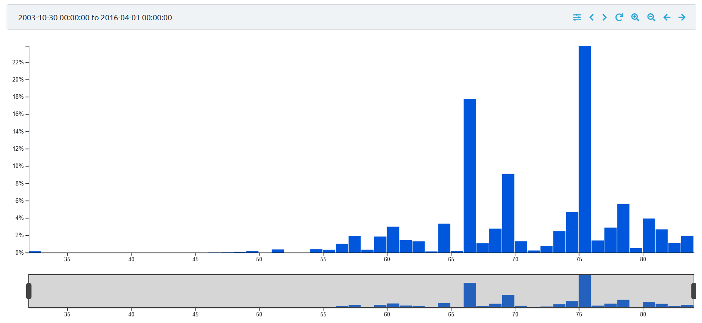

# Examples

## LineChart

*templates/linechart*

Line chart template with signals configurable through parameters.

## Hans Rosling's bubble plot

*templates/hans_rosling_bubble*

Simple bubble plot template without parameters. The example contains version without and with legend. This template was created as part of Michal Töpfer's bachelor thesis where it is described in detail: [Section 7.2](https://gimli.ms.mff.cuni.cz/~topfermi/ivis/thesis.pdf#section.7.2) ([mirror](https://is.cuni.cz/webapps/zzp/detail/222158)).

## Correlogram

*templates/correlogram*

Template showing several scatter plots to visualize the correlation among more than two signals (specified in panel parameters). This template was created as part of Michal Töpfer's bachelor thesis where it is described in detail: [Section 7.3](https://gimli.ms.mff.cuni.cz/~topfermi/ivis/thesis.pdf#section.7.3) ([mirror](https://is.cuni.cz/webapps/zzp/detail/222158)).

## Scatter plot with legend

*templates/scatterplot_legend*

This template shows how to use the `Legend` component to allow user to (temporarily) modify the panel parameters. It was created as part of Michal Töpfer's bachelor thesis where it is described in detail: [Section 7.4](https://gimli.ms.mff.cuni.cz/~topfermi/ivis/thesis.pdf#section.7.4) ([mirror](https://is.cuni.cz/webapps/zzp/detail/222158)). This is an updated version of the template.

## Synchronized views

*templates/sync_view*

A more advanced template showing how to connect two charts to update their zoom synchronously. This template was created as part of Michal Töpfer's bachelor thesis where it is described in detail: [Section 7.5](https://gimli.ms.mff.cuni.cz/~topfermi/ivis/thesis.pdf#section.7.5) ([mirror](https://is.cuni.cz/webapps/zzp/detail/222158)).

## Heatmap

*templates/heatmap*

A template which shows a heatmap with properties set through JSON parameter.

## Histogram with metric

*templates/histogram_metric*

This template shows how to use a metric in a histogram to make the bars' height depend on a sum of a signal's values instead of count of records. This charts shows histogram of fertility rate of countries of the world with the height of bars corresponding to the sum of the populations of countries belonging to the bucket.

